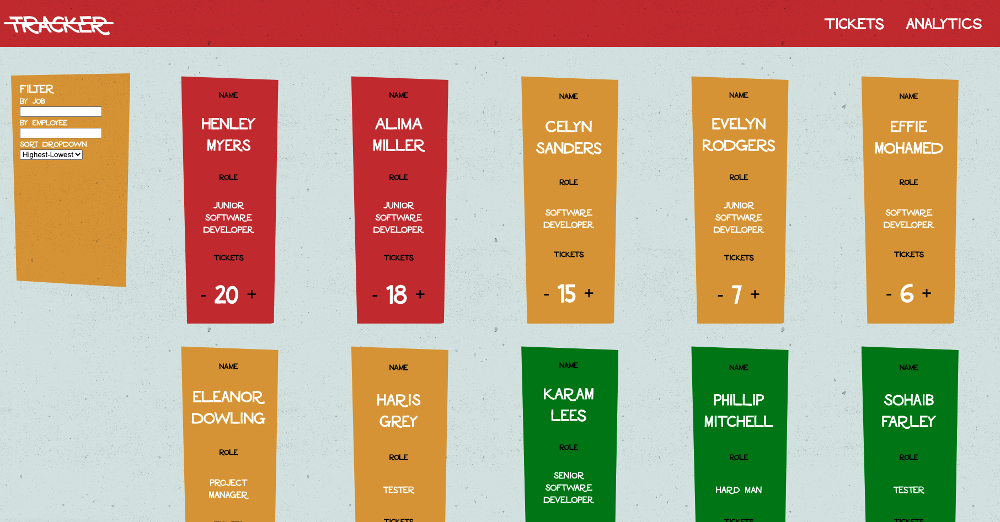

## Ticket Tracker
## 

App developed to count tickets assigned to employees in a team. Filters and graphs were implemented to visualise data. Project required significant understanding of React based object rendering and state management. The design and layout was inspired by the title sequences of Saul Bass.

## Tech Stack

